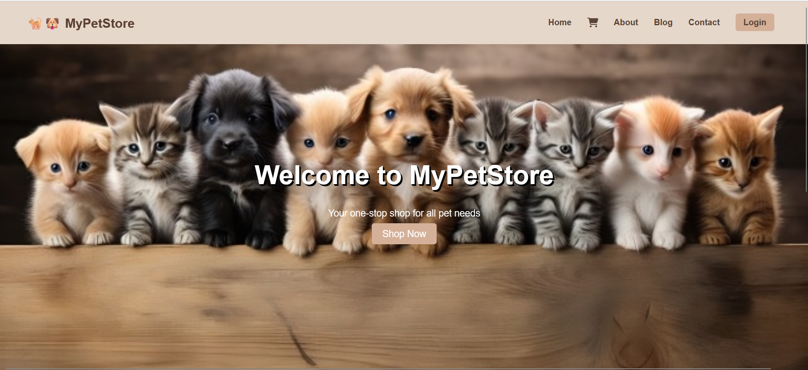
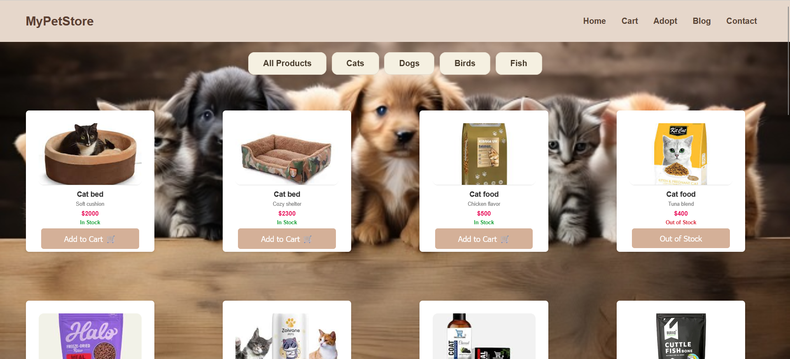
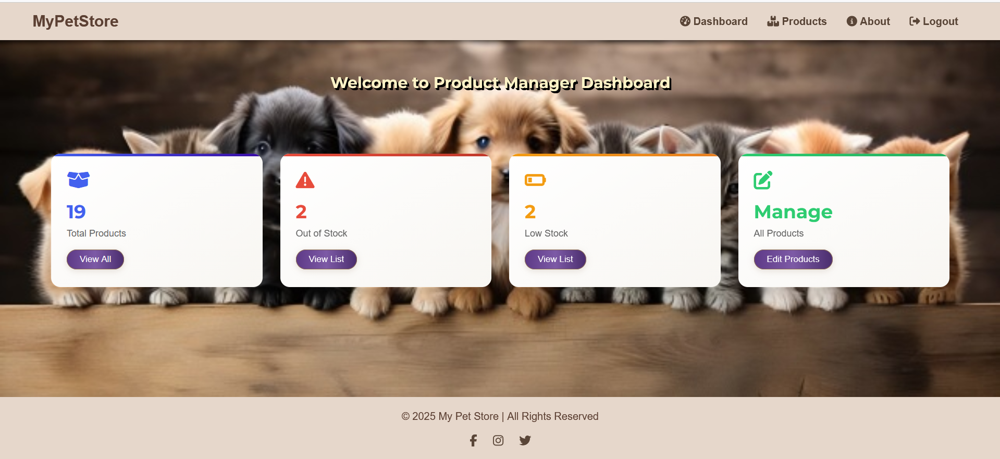
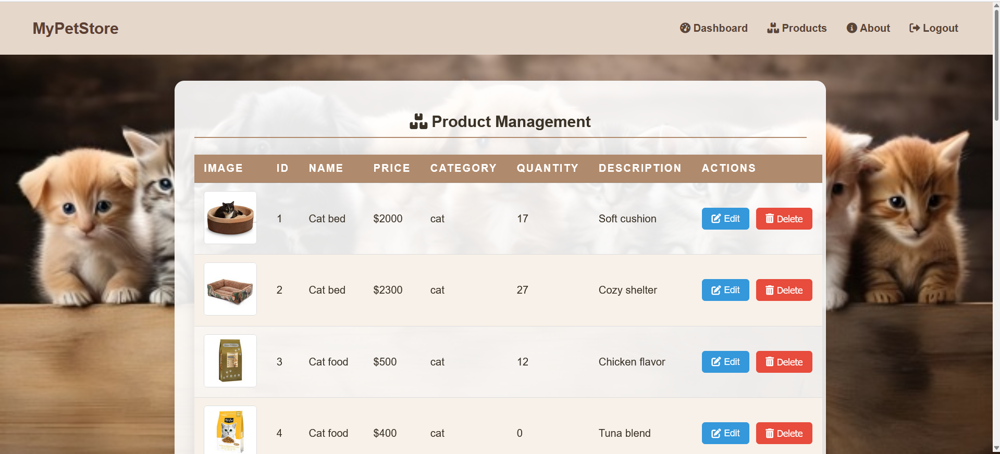
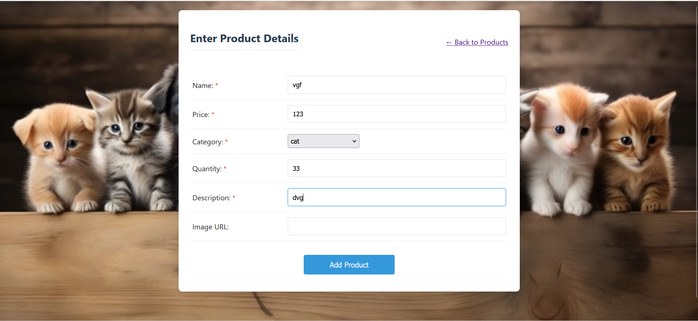
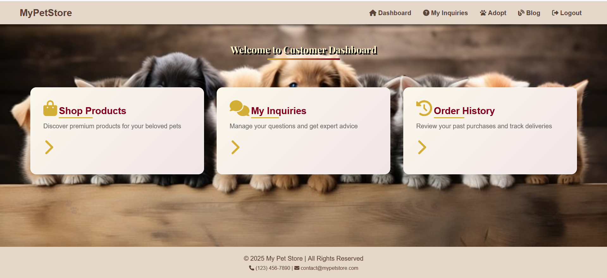
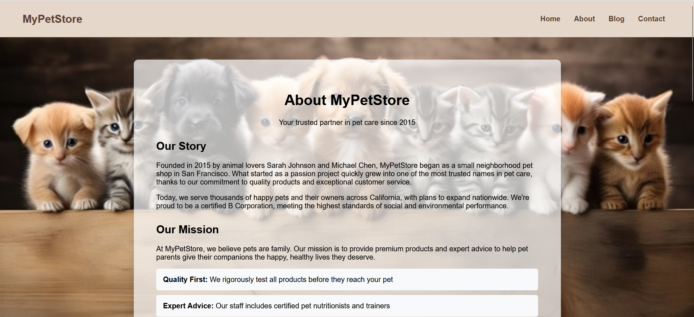

# 🐾 eStore – Online Pet Store

## Project Overview

**eStore** is a Java EE-based web application designed for managing an online pet store. The system allows customers to browse products, manage their cart, and place orders, while administrators can perform full product management and inventory operations.

This project was developed as a university group assignment.

---

## Technologies Used

**Backend:** Java, Servlets, JSP
**Frontend:** HTML, CSS, JavaScript, Bootstrap
**Database:** MySQL
**Server:** Apache Tomcat
**IDE:** Eclipse

---

## Key Features

* User registration and authentication (role-based access)
* Product Management (Create, Read, Update, Delete)
* Product catalog by categories (Dogs, Cats, Fish, Birds)
* Shopping cart with quantity management
* Order management and history tracking
* Admin dashboard for inventory control
* Search and filter products
* Customer inquiry/support system

---

## My Contribution

* Designed and implemented the complete backend for **Product Management**
* Developed Servlet controllers and JSP pages
* Implemented database connectivity using DAO pattern
* Designed responsive frontend interfaces for product management

---

## Application Screenshots

### Homepage & Shop

  
  

### Product Manager Dashboard & CRUD

  
  

### Add Product & Client Dashboard

  
  

### About Page

  

---

## Demo Video

🎥 https://drive.google.com/file/d/1XB3FNCjphdId3UrEM4pjimHeqAXO5qs3/view?usp=sharing

---

## Database

Database schema screenshots are available in:
[Database Files](./docs/database)

---

## Setup Instructions

### Prerequisites

* Java JDK 8+
* Apache Tomcat 9+
* MySQL Server
* Eclipse IDE (Enterprise Edition)

### Deployment Steps

1. Import the project into Eclipse as a **Dynamic Web Project**
2. Configure Apache Tomcat server
3. Set up the MySQL database
4. Deploy and run the project on Tomcat

---

## Note

This system was developed as part of a university group project for academic purposes.

